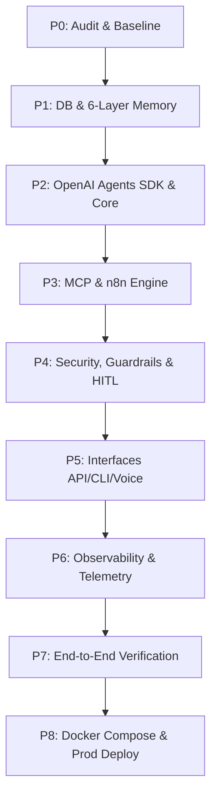

# Jefrey Master Implementation Roadmap (P0 - P8)

## Overview
This document defines the step-by-step master rollout strategy for transforming the RAR / Jefrey initial codebase into a production-grade personal assistant system.

---

## Status Atual (2026-08-28)

| Fase | Título | Status | Notas |
|------|--------|--------|-------|
| P0 | Audit & Baseline | ✅ Concluído | 7/7 smoke tests; 5 bug fixes (07_P0_AUDIT_FINDINGS) |
| P1 | DB & 6-Layer Memory | ✅ Concluído | PostgreSQL+pgvector+Redis; verify_p1 e2e (08_P1_IMPLEMENTATION) |
| P2 | OpenAI Agents SDK & Core | ✅ 100% (SEG/OBS fechados) | checkpointer Postgres (substitui MemorySaver) + runtime `openai` opcional via Agents SDK + PolicyEngine RBAC/HITL; verify_p2 (12_P2_IMPLEMENTATION) |
| P3 | MCP & n8n Engine | 🟢 P3a 100% (P3b/P3c pendentes) | MCP Server dedicado streamable-http :8001 (PolicyEngine na rede, thread_id do request); BUG-P3a-01 corrigido; verify_p3a (14_P3A_IMPLEMENTATION) |
| P4 | Security, Guardrails & HITL | ⏳ Pendente | tabela `approvals` já existe (model P1) |
| P5 | Interfaces API/CLI/Voice | ⏳ Pendente | |
| P6 | Observability & Telemetry | ⏳ Pendente | |
| P7 | End-to-End Verification | ⏳ Pendente | |
| P8 | Docker Compose & Prod Deploy | ⏳ Pendente | |

> **Decisão de arquitetura (P2):** o runtime `langgraph` permanece o default (funciona com Ollama local).
> O runtime `openai` (OpenAI Agents SDK & Responses API) é selecionável por `JEFREY_AGENT__PROVIDER=openai`
> e requer um endpoint compatível com a *Responses API* da OpenAI (Ollama não a implementa).

---

## Phase Breakdown

---

### Phase P0: Audit & Baseline Verification
- **Goal:** Complete code, inventory, security, and dependency audits across existing codebase (`src/jarvis` and `src/jefrey`).
- **Deliverables:**
  - `JEFREY-AUDIT/` complete documentation suite (00 through 06).
  - Cleaned repository structure and baseline test suite validation.

---

### Phase P1: Database & 6-Layer Memory Infrastructure
- **Goal:** Migrate from SQLite / ChromaDB to unified PostgreSQL (`ankane/pgvector`) + Redis cache.
- **Deliverables:**
  - Docker service for PostgreSQL 16 + pgvector and Redis 7.2.
  - SQLAlchemy models for:
    - Working Memory (Redis short-term state / turn context)
    - Episodic Memory (vector search via pgvector for past conversations & interactions)
    - Semantic Memory (knowledge base & facts vector index)
    - Preference Memory (structured user preferences & constraints)
    - Procedural Memory (tool execution workflows & recipes)
    - Operational Memory (system execution state, background tasks)
  - Migration script replacing ChromaDB references in `src/jefrey/core/memory.py`.

---

### Phase P2: Core Agent Framework & Responses API
- **Goal:** Upgrade core agent runtime to OpenAI Agents SDK & Responses API (2026 stateful paradigm).
- **Deliverables:**
  - Modernized agent runtime (`src/jefrey/core/agent.py`) com facade selecionável por `JEFREY_AGENT__PROVIDER`.
  - Runtime `openai` (`src/jefrey/core/openai_agent.py`) usando `agents.Agent` + `agents.Runner` (Responses API).
  - `PostgresSessionStore` persistindo sessões por `thread_id` (tabela `agent_sessions`).
  - Checkpointer Postgres (`src/jefrey/core/checkpointer.py`, `AsyncPostgresSaver`) substituindo o `MemorySaver` em memória.
  - Conversor LangChain `BaseTool` -> `function_tool` com schema Pydantic preservado + ferramenta `memory_search`.

---

### Phase P3: MCP Gateway & n8n Automation Engine
- **Goal:** Establish MCP tool gateway and n8n workflow execution node integration.
- **Deliverables:**
  - MCP Server & Client implementation complying with MCP 2026-07-28 RC spec.
  - Dynamic MCP tool discovery bridge inside `ToolRegistry`.
  - n8n integration bridge exposing webhooks and trigger/client nodes for complex automation.

---

### Phase P4: Multi-Layer Security, Guardrails & HITL Approval Engine
- **Goal:** Implement comprehensive threat mitigation, RBAC, input/output guardrails, and HITL approvals.
- **Deliverables:**
  - Regex-based input guardrails detecting prompt injection / jailbreaks.
  - Regex & Fernet output sanitizers masking PII, credentials, and API keys.
  - Role-Based Access Control (`admin`, `user`, `guest`) for tool execution.
  - HITL Approval Engine (`approvals` table in DB) intercepting `high` and `critical` risk tools.

---

### Phase P5: Interface Layer (CLI, REST API, Voice)
- **Goal:** Expose flexible interaction interfaces.
- **Deliverables:**
  - FastAPI web server (`src/jefrey/interfaces/api/`) with JWT authentication and streaming response endpoints.
  - Enhanced Interactive CLI client with colored streaming output and memory status indicators.
  - Voice pipeline placeholder/STT-TTS gateway integration.

---

### Phase P6: Observability, Metrics & Telemetry
- **Goal:** Ensure full production visibility into agent execution, latency, and LLM token costs.
- **Deliverables:**
  - OpenTelemetry integration tracing agent turns, tool calls, and DB queries.
  - Prometheus metrics exporter tracking token counts, latency histograms, and cost estimates.
  - Grafana dashboard template for real-time monitoring.

---

### Phase P7: Integration Testing & Verification
- **Goal:** Validate end-to-end functionality across all layers.
- **Deliverables:**
  - Integration test suite covering 6 memory layers retrieval.
  - HITL approval flow test (request -> pending -> user approval -> execute).
  - MCP & n8n mock execution tests.

---

### Phase P8: Production Deployment & Docker Compose Harmonization
- **Goal:** Ship production-ready multi-container containerization stack.
- **Deliverables:**
  - `docker-compose.yml` unifying PostgreSQL/pgvector, Redis, n8n, FastAPI Backend, and Grafana/Prometheus.
  - Environment configuration templates (`.env.example`) and security secret management guidelines.
  - Operational runbooks for backup, restore, and database vacuuming.
