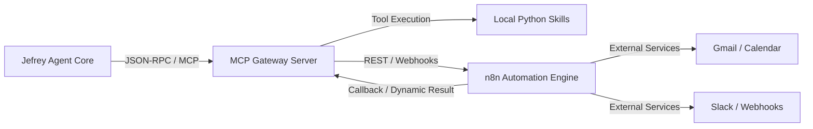
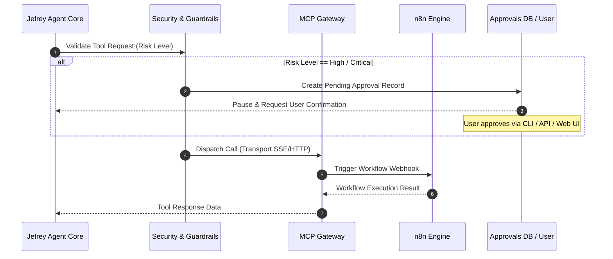

# n8n & Model Context Protocol (MCP) Integration Plan

## Overview
This document outlines the architecture and integration strategy for utilizing **Model Context Protocol (MCP)** as a standardized tool gateway and **n8n** as a visual workflow automation engine within Jefrey.

---

## 1. Architecture Overview

---

## 2. MCP (Model Context Protocol) Implementation Strategy

### 2.1 Spec Standard Compliance
- Target Spec: MCP Specification (2026-07-28 Release Candidate).
- Core protocol over SSE (Server-Sent Events) or stdio transport.
- Header-based authorization passing caller context and session tokens.

### 2.2 Server Architecture
- `src/jefrey/integrations/mcp/server.py`: Internal MCP Server exposing local skills (`Notes`, `Calendar`, `Email`, `Search`).
- Dynamic Tool Registration: `ToolRegistry` automatically converts Python skill functions into MCP Tool Definitions (JSON Schema).

### 2.3 Client & Remote Tools Architecture
- `src/jefrey/integrations/mcp/client.py`: MCP Client connecting to external MCP servers (e.g., filesystem MCP, database MCP, GitHub MCP).
- Risk-Level Tagging: Tools fetched via MCP client inherit risk levels (`low`, `medium`, `high`, `critical`) for security evaluation before execution.

---

## 3. n8n Automation Engine Integration Strategy

### 3.1 Role of n8n in Jefrey
- n8n handles long-running, multi-step, visually configurable workflows (e.g., complex multi-app data synchronization, scheduled batch reporting).
- Jefrey's agent core maintains high-level decision making and delegates complex execution subgraphs to n8n.

### 3.2 Bidirectional Bridge
1. **Agent-to-n8n (Execution Trigger):**
   - Jefrey exposes an `execute_n8n_workflow` skill tool.
   - Triggers n8n workflows via authenticated REST webhooks passing payload and context headers.
2. **n8n-to-Agent (MCP Node & Event Injection):**
   - Custom n8n MCP Node or HTTP Request node calls Jefrey's MCP Server / REST API.
   - Allows n8n workflows to query Jefrey's 6-layer memory or trigger agent cognitive loops asynchronously.

---

## 4. Execution Sequence: HITL & Security Handling

---

## 5. Deployment & Configuration Checklist
- [ ] Add `n8nio/n8n:latest` service to `docker-compose.yml`.
- [ ] Configure PostgreSQL shared or dedicated database for n8n execution state.
- [ ] Implement MCP Server in `src/jefrey/integrations/mcp/`.
- [ ] Implement MCP dynamic tool registry bridge in `src/jefrey/core/agent.py`.
- [ ] Test end-to-end workflow invocation and output sanitization.
